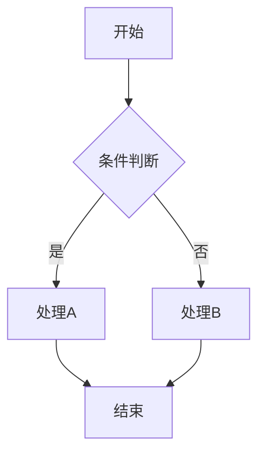
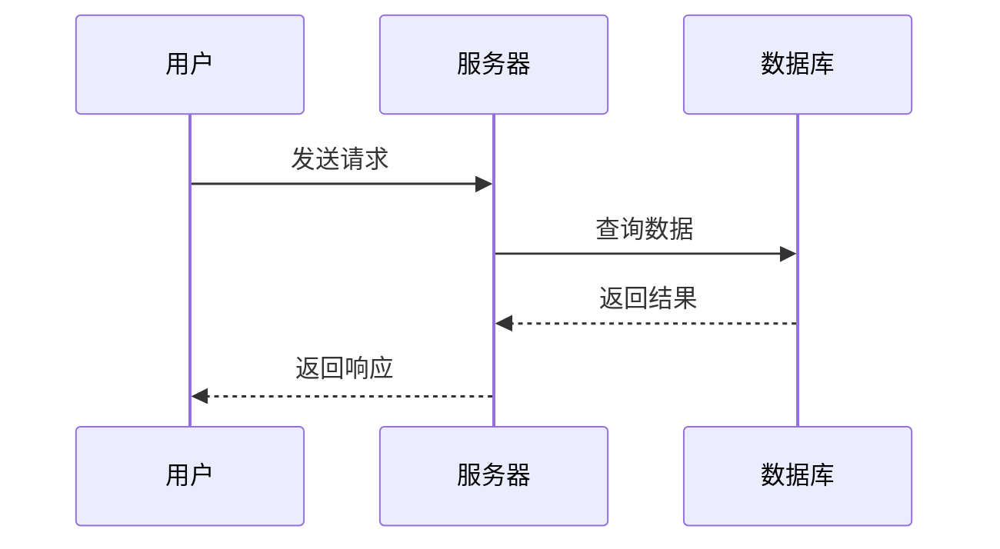
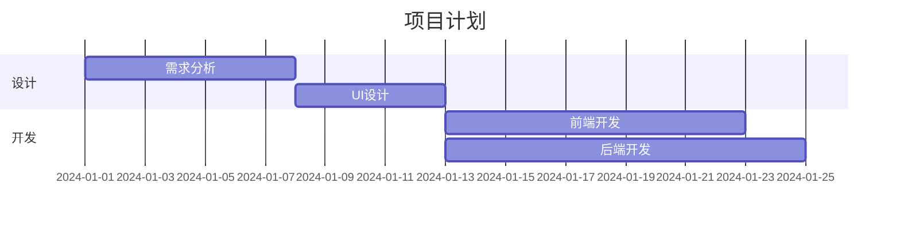

# 快速入门指南

## 5 分钟上手 WebView Factory

### 第一步：添加依赖

在你的模块的 `build.gradle.kts` 中：

```kotlin
dependencies {
    implementation(project(":lib-webview_factory"))
}
```

### 第二步：添加权限

在 `AndroidManifest.xml` 中：

```xml
<uses-permission android:name="android.permission.INTERNET" />
```

### 第三步：使用

#### 最简单的例子（3 行代码）

```kotlin
val factory = WebViewFactory.getInstance(context)

factory.submitTask(
    MermaidRenderTask(mermaidCode = "graph TD\n    A-->B"),
    object : RenderCallback {
        override fun onRenderComplete(result: RenderResult) {
            when (result) {
                is RenderResult.Success -> {
                    // result.imageData 就是图片字节数组
                    File("output.png").writeBytes(result.imageData)
                }
                is RenderResult.Error -> {
                    Log.e("Render", result.errorMessage)
                }
            }
        }
    }
)
```

就这么简单！

## 常见使用场景

### 场景 1：渲染单个图表

```kotlin
val task = MermaidRenderTask(
    mermaidCode = """
        graph TD
            A[开始] --> B[处理]
            B --> C[结束]
    """.trimIndent()
)

WebViewFactory.getInstance(context).submitTask(task, callback)
```

### 场景 2：批量生成多个图表

```kotlin
val tasks = listOf(
    MermaidRenderTask(mermaidCode = "graph TD\n    A-->B"),
    MermaidRenderTask(mermaidCode = "graph LR\n    C-->D"),
    MermaidRenderTask(mermaidCode = "graph TD\n    E-->F")
)

WebViewFactory.getInstance(context).submitTasksBatch(tasks, callback)
// 结果会按照提交顺序返回
```

### 场景 3：流式处理（打字机模式）

```kotlin
val submitter = factory.createStreamSubmitter(callback)

// 数据逐个到达时
dataFlow.collect { mermaidCode ->
    submitter.submitNext(MermaidRenderTask(mermaidCode = mermaidCode))
}
// 结果会按照提交顺序依次返回
```

## 参数配置

### 图片尺寸和质量

```kotlin
MermaidRenderTask(
    mermaidCode = code,
    width = 1920,          // 宽度
    height = 1080,         // 高度
    quality = 90,          // 质量 (0-100)
    format = ImageFormat.PNG  // 格式 (PNG/JPG/WEBP)
)
```

### 工厂配置

```kotlin
WebViewFactory.getInstance(
    context = context,
    workerCount = 5,      // Worker数量（并发数）
    maxPoolSize = 8       // WebView池最大值
)
```

## 监控和调试

### 查看工厂状态

```kotlin
val stats = factory.getFactoryStats()
Log.d("Factory", """
    Workers: ${stats.busyWorkerCount}/${stats.workerCount}
    Queue: ${stats.queuedTaskCount}
    WebView Pool: ${stats.poolStats.availableSize}/${stats.poolStats.totalSize}
""")
```

### 进度监听

```kotlin
object : RenderCallback {
    override fun onRenderComplete(result: RenderResult) { }

    override fun onProgress(taskId: String, progress: Int) {
        Log.d("Progress", "$taskId: $progress%")
    }
}
```

## 资源管理

### 释放资源

```kotlin
// 在 Activity.onDestroy() 或 Application.onTerminate() 中
WebViewFactory.destroyInstance()
```

### 取消任务

```kotlin
val taskId = factory.submitTask(task, callback)
factory.cancelTask(taskId)  // 取消队列中等待的任务
```

## Mermaid 图表示例

### 流程图



### 序列图



### 甘特图



## 完整示例

查看完整的代码示例：

- **基础示例**: `lib-webview_factory/src/main/java/com/tcm/lib/webview/factory/example/ExampleUsage.kt`
- **UI 示例**: `app/src/main/java/com/tcm/webviewfactory/DemoActivity.kt`

## 运行示例应用

```bash
./gradlew :app:installDebug
```

然后在手机上打开应用，点击"查看演示"按钮。

## 常见问题

### Q: 为什么需要网络权限？

A: 因为需要从 CDN 加载 Mermaid.js 库。

### Q: 可以离线使用吗？

A: 可以，将 Mermaid.js 下载到本地，修改 HTML 模板引用本地文件即可。

### Q: 支持哪些图片格式？

A: 支持 PNG、JPG、WebP 三种格式。

### Q: 最大并发数是多少？

A: 默认 3 个 Worker，可以配置。建议不超过设备 CPU 核心数。

### Q: 内存占用大吗？

A: WebView 占用内存较大，建议监控内存使用情况。默认最多 5 个 WebView 实例。

### Q: 如何处理大量任务？

A: 工厂会自动排队处理，无需担心。可以通过 `getFactoryStats()` 监控队列情况。

## 下一步

- 阅读完整文档：[README.md](README.md)
- 查看 API 文档：[lib-webview_factory/README.md](lib-webview_factory/src/main/java/com/tcm/lib/webview/factory/README.md)
- 学习 Mermaid 语法：https://mermaid.js.org/

---

祝你使用愉快！如有问题请提 Issue。
